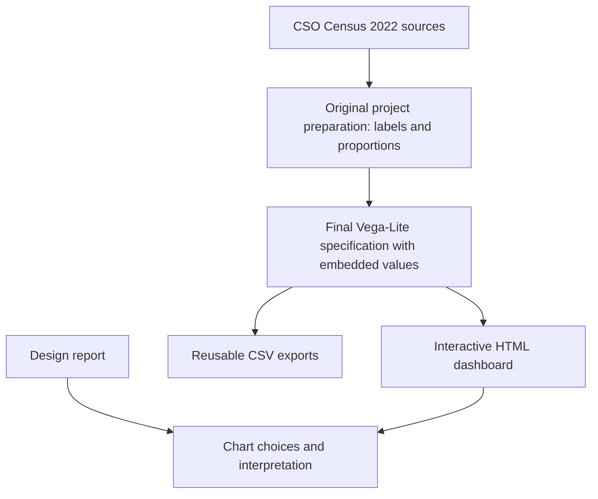

# Ireland Census Visualisation

### Who is moving to Ireland, and what housing outcomes do they face?

An interactive, four-panel dashboard exploring recent immigration, age composition, housing tenure and average weekly rent by citizenship using Census 2022 data.

**James McClatchie · COMP47970 Information Visualisation · Individual project**

[Dashboard source](index.html) · [Vega-Lite specification](specs/dashboard.vl.json) · [Design report](docs/design-report.pdf) · [Data and limitations](docs/DATA.md)

## Project overview

A ranking of immigration counts answers only one part of the question. This project brings four views together so readers can explore the size and composition of citizenship groups alongside housing measures. A single citizenship dropdown coordinates the views, and tooltips expose the underlying values.

The dashboard supports descriptive comparison. Its panels should not be interpreted as linked individual records or as evidence that immigration causes particular housing outcomes.

## Explore the dashboard

| View | Visual form | What to look for |
| --- | --- | --- |
| Recent immigrants | Ranked horizontal bars | The ten citizenship categories included in the project |
| Age profile | Proportional stacked bars | How age composition differs within each category |
| Housing tenure | Proportional stacked bars | The balance of ownership, renting and other tenure categories |
| Weekly rent | Points and a dashed reference line | Average weekly rents and the original €273 benchmark |

1. Start with **All** to compare the included citizenship groups.
2. Choose a citizenship from the dropdown. The immigration chart highlights it while the age, tenure and rent views filter to it.
3. Hover over a mark for counts, proportions or rent values.
4. Return to **All** to restore the overview.

Citizenship means the census citizenship category, not birthplace. In particular, **Ireland** identifies Irish citizenship; it does not automatically identify people born in Ireland.

## Run locally

Download the repository and open `index.html` in a browser. The data is embedded, but an internet connection is needed to load the Vega libraries from jsDelivr.

Alternatively, serve the folder locally:

```bash
git clone https://github.com/JamesManOB/ireland-census-visualisation.git
cd ireland-census-visualisation
python -m http.server 8000
```

Open <http://localhost:8000>. GitHub's file viewer displays HTML source; it does not run the dashboard.

To edit the visualisation, open `specs/dashboard.vl.json` in the [Vega Editor](https://vega.github.io/editor/), or edit it locally and rebuild:

```bash
python scripts/build.py
```

The build uses Python's standard library and regenerates `index.html` plus the four CSV exports. No application build system or database is required.

## From data to visualisation



The original preparation is described in the design report; its raw downloads and cleaning script were not present in the supplied project folder. The included build reproduces the dashboard and exports from the final specification, rather than reconstructing the original CSO preparation.

## Design decisions

- **Horizontal bars** accommodate long citizenship labels and make ranked counts easy to compare.
- **Proportional stacked bars** compare composition across groups of different sizes. Interior segments are less precise to compare because they lack a shared baseline.
- **A rent point plot** keeps the display light while the dashed line provides a reference.
- **One dropdown** makes the interaction visible and predictable. Colour scales are independent across the different measures.
- **Four coordinated views** allow side-by-side exploration without requiring the reader to remember earlier screens.

The [original design report](docs/design-report.pdf) explains the alternatives considered, including grouped bars, pie charts and a map, and contains the academic references.

## Repository guide

| Path | Purpose |
| --- | --- |
| `index.html` | Runnable dashboard with embedded data and a repaired HTML wrapper |
| `specs/dashboard.vl.json` | Unmodified final Vega-Lite specification; source for the build |
| `data/` | Four CSV tables extracted from the final embedded values |
| `scripts/build.py` | Rebuilds the HTML entry point and CSV exports |
| `docs/design-report.pdf` | Original submitted design document |
| `docs/DATA.md` | Fields, provenance, interpretation and limitations |
| `originals/visualization.html` | Unmodified original HTML export |
| `originals/dashboard-csv-prototype.vl.json` | Original earlier CSV-based, click-selection prototype |

## Data and interpretation

The report identifies **CSO table F5020** for recent immigration counts and **Census 2022 Profile 5** for contextual interpretation. F5020 concerns people aged one year and over, usually resident and present in the State, who lived outside the State one year earlier.

The source material does not identify the exact housing and rent table IDs or fully document their population denominators. The €273 line is a fixed value in the original specification. These details need checking against the original CSO extracts before making stronger comparisons across panels. See [the data notes](docs/DATA.md).

This is a Census 2022 project, not a live measure of migration or today's rental market. Averages hide within-group variation, and the displayed ten categories are not the full population.

## Tools and skills demonstrated

Vega-Lite · Vega-Embed · HTML · coordinated interaction · categorical comparison · proportional encoding · data preparation documentation · visual design evaluation

The original HTML uses Vega 6.2.0, Vega-Lite 6.4.1 and Vega-Embed 7.1.0; the specification declares the Vega-Lite v5 schema. These original versions are preserved.
